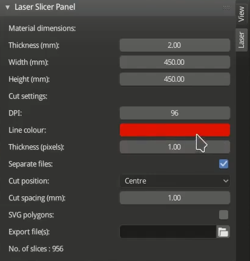

TODO: power and velocity settings

In this FabLab Friday workshop we will explore techniques for slicing 3D models into 2D layers for laser cutting. Our goal will be to produce a cardboard lamp. Cardboard is a great material for lamp-making, as it's corrigated nature allows light to escape in interesting ways.

<p align="center">
  
   
</p>

<p align="center">
  
   
</p>

# Tools and Workflow

We will work using Windows as our operating system and our main tools will be:
- the 3D CAD package [Blender]()
- a third party [laser slicer plugin]()
- the 2D vector design software [Inkscape]()
- Adobe Acrobat
- Trotec Rayjet Manager (the software used to control our lab laser cutter)

The slicer plugin will allow us to take any 3D object, define a slice height and produce a vector graphics file that contains a layer for each slice. Inkscape will be used to tidy up the layers and arrange them into sheets. Your team will be given two sheets of 740mmx440mm cardboard to get you started.

Don't worry if you don't manage to produce a completed lamp by the end of the session, as there will be time to experiment further next week during our open Friday session.

# Schedule

- __14:00__ Introduction and demo of the slicing process
- __14:30__ Split into three teams and initial exploration of the tools
- __15:10__ Laser cutter onboarding
	- one or two people from each team
- __15:30__ Laser Time
	- Each team gets 40 minutes of laser-cutter time
		- __Team 1__: 15:30 - 16:10
		- __Team 2__: 16:10 - 16:50
		- __Team 3__: 16:50 - 17:30
- __17:30__ Informal presentations, knowledge-sharing and wrap-up

# Laser Cutter Safety Rules (Recap)

You must have completed a short onboarding before you can use the laser cutter independently in the lab. For those that haven't done it already, we will integrate it into today's session.

- When cutting:
	- Close vents 1-4
	- Ensure the ventilation system is turned up and is on (makes noise)
	- Inform anyone working outside
- When done cutting: re-open vents 1 and 4
- __NEVER__ leave the laser cutter unattended
- Take special care with cardboard not to cause fire!
- If there's an out-of-control fire, use CO2 extinguisher only (next to the laser cutter)
- Always test on a small piece of material first to dial-in your settings
- Example cutting settings for 4mm cardboard are x power, x velocity

# Getting Started

To learn the technique, we will first spend less time designing and more time on the slicing process, so we suggest to either:

1. Download an appropriate model from [Printables](https://www.printables.com/) e.g [this bowl](https://www.printables.com/model/635944-bowl-shaped-bowl)

2. Design a simple form in Blender, Tinkercad or Fusion

Whichever method you choose, you should export the final model in .stl format, ready to be imported to Blender to slice. 

Note: Pay special attention to the wall thickness of your object. Too thick and light won't easily get through, too thin and your lamp will be too flimsy

# Slicing Using Blender and the Laser Slicer Plugin

Install [the plugin](https://github.com/rgsouthall/laser_slicer) if it hasn't been done for you already. Then follow these intructions:

1. Import the model as an .stl into Blender
2. Scale it to an appropriate size (so we don't generate 100's of layers!)
3. Ensure the Laser Slicer plugin is ticked in Edit > Preferences -> Add-ons
4. A panel called `laser` should have now appeared, which looks as follows:



Choose the following settings:
- __Thickness__: 3mm (or measure your material)
- __Width__: 740mm (max width of laser cutter bed, or set to width of your material)
- __Height__: 440mm (max height of laser cutter bed, or set to width of your material)
- __DPI__: 96
- __Line Colour__: RGB 255 0 0 0
- __Thickness__: ideally we need 0.1mm thickness, which is 0.38 pixels at 96 DPI, but it seems the minimum possible value here is 1 pixel
- __Separate files__: unticked
- __Cut spacing__: 1mm
- __SVG polygons__: unticked

5. Choose an appropriate location, select your 3D object and click "Slice the Object"

From here on in, the challenge will be to arrange the cuts on the sheet to make optimal use of material. It should be possible to organise the layers in two sheets, in such a way that they are inside of each other, but that they don't overlap.

# RayJet Manager Settings


The final 'print' to the laser cutter software should be done from Adobe software (Illustrator or Acrobat). Our RayJet Manager laser cutter software is very picky about the kinds of vector file it will cut. Some tips for preparing the file in Inkscape are:

1. Select all objects and in 'Fill and Stroke' settings:
- Remove any fill
- Choose a stroke width of between 0.01 and 0.1mm
- Choose a stroke colour of pure red (i.e. RGB 255 0 0)

2. Bring up the layers pane and inspect the layers. There should be no text layers or unexpected layers other than vector lines.

3. Save the file in PDF format.

4. Open the PDF in Adobe Acrobat.
- Now choose Print and choose RayJet Manager, click the print button and wait for the job to come through to the RayJet Manager software
- Then click on the job in the list on the right and look for a red 'timing' in the pane on the left
- If there's no timing there, something went wrong. If there is a timing, all is well and you can go on to select the correct power and speed settings.

# Futher Explorations and Alternative Approaches

Whilst researching this workshop, we found many interesting techniques that you might wish to delve into, given more time:

## Experimenting with Spiral Forms

Spiral forms are great as they we don't need to slice them - they naturally hang down and also make optimum use of materials.


We found some inspiring designs [here](https://www.thingiverse.com/thing:3526359) and [here](https://www.thingiverse.com/thing:2639588)

## Other Blender Plugins

Check out [Flatterer](https://extensions.blender.org/add-ons/flatterer/)

## OpenSCAD and Laser Slicer Plugin

OpenSCAD is free software for programmatically creating solid 3D CAD objects using code. Here's an example of the code:

```
two_cubes_and_a_cylinder.scad

cube([60,20,10],center=true);
translate([5,0,10 - 0.001])
    cube([30,20,10],center=true);
translate([0,-20,0])
    cylinder(h=3,r=8);
```

OpenSCAD also comes with a command line interface to allow commands such as: `openscad -o output.svg input.scad`. This interface can also be scripted specifically for laser cutter slicing using [this python script](https://github.com/frezik/laser_slicer)

## Slic3r

[Slic3r](https://slic3r.org/) has a command line tool that allows you to export SVG slices

`slic3r --export-svg --output output.svg input.stl`

## Fusion

A similar [3rd party plugin](https://www.autodesk.com/support/technical/article/caas/tsarticles/ts/3yg7zznS94MHNDG7KMV8Qg.html) to the one we've been using exists for Autodesk Fusion, but this is no longer maintained, unfortunately. But maybe you can find a workaround